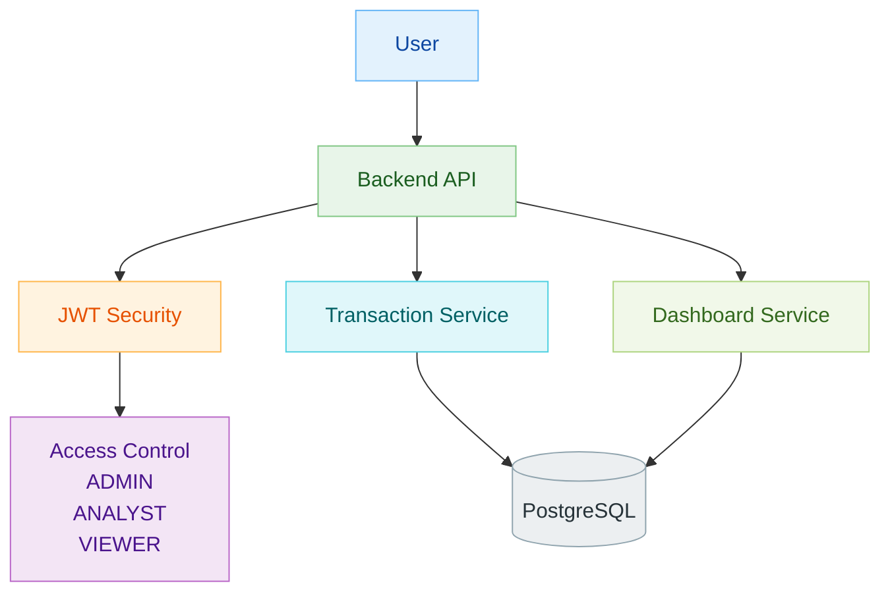

# Transaction Management Backend

A Spring Boot backend application for managing financial transactions with secure user access, validation, dashboard insights, and analytics.

## Project Overview

This project was built as a Spring Boot project to demonstrate backend design ability, API design practices, validation handling, security implementation, and clean code structure.

The application supports:

- User registration and login
- JWT-based authentication
- Role-based access control
- Transaction CRUD operations
- Search, filtering, sorting, and pagination
- Dashboard summary APIs
- Analytics APIs for category-wise spending and monthly trends
- Structured exception handling
- Swagger/OpenAPI-based API documentation

## Key Highlights

- Built as a Spring Boot project with clean layered architecture
- Followed a design-first approach using Swagger/OpenAPI
- Generated API interfaces and DTOs from the OpenAPI contract
- Implemented JWT authentication and role-based authorization
- Applied validation through API schema, entity constraints, and service rules
- Added reporting-focused APIs beyond basic CRUD
- Centralized exception handling for consistent API responses

## Architecture

## Approaches Followed

- Designed APIs first using Swagger/OpenAPI before coding
- Used the API contract as the source of truth for implementation
- Separated concerns into controller, service, repository, mapper, config, and exception layers
- Kept controllers lightweight and handled business logic in services
- Scoped data access to the authenticated user
- Used DTOs instead of exposing entities directly
- Added custom queries for search, filtering, and analytics
- Handled security through JWT and role-based access rules

## API Documentation

API documentation was created using Swagger/OpenAPI in `transaction.yaml`.

This design-first approach helped define:

- Endpoints
- Request and response models
- Query parameters
- Validation rules
- Error response structures

The OpenAPI contract was then used to generate:

- API interfaces
- DTO classes

This ensured the implementation remained aligned with the documented API design.

## Security

The application uses JWT-based authentication for secure access.

### Roles Implemented

- `ADMIN`
  - Can create, update, and delete transactions
  - Can access analytics and dashboard data
- `ANALYST`
  - Can access analytics and dashboard data
  - Can view transactions
- `VIEWER`
  - Can view transactions and dashboard data

### Security Features

- JWT token generation on login
- Request authentication using JWT filter
- Role-based authorization using `@PreAuthorize`
- Authenticated user-based transaction access

## Validation and Error Handling

Validation is handled at multiple levels:

- OpenAPI schema validation
- Entity-level constraints
- Service-level business validation

Examples:

- Required request fields
- Enum-based allowed values
- Email format and pattern validation
- Preventing invalid transaction dates
- Handling malformed JSON and invalid input values

Error handling is centralized using global exception handling to return consistent error responses with:

- Timestamp
- Message
- Details
- Request path

## Response Code Handling

The API returns standard HTTP status codes to clearly represent the result of each request.

- `200 OK` for successful read, update, and login operations
- `201 Created` for successful resource creation
- `204 No Content` for successful deletion
- `400 Bad Request` for invalid input, malformed JSON, or validation failures
- `401 Unauthorized` when authentication is missing or invalid
- `403 Forbidden` when the user does not have permission to access a resource
- `404 Not Found` when the requested transaction is not available
- `500 Internal Server Error` for unexpected server-side failures

## Features Implemented

### Authentication
- User registration
- User login
- JWT token generation

### Transaction Management
- Add transaction
- Update transaction
- Delete transaction
- Get transaction by ID
- Get all transactions

### Advanced Query Support
- Filter by transaction type
- Filter by category
- Filter by date range
- Sort results
- Paginate results
- Search by keyword

### Dashboard
- Total income
- Total expenses
- Net balance
- Recent transactions

### Analytics
- Category-wise expenditure
- Monthly profit trends

## Tech Stack

- Java 21
- Spring Boot 3
- Spring Web
- Spring Data JPA
- Spring Security
- JWT
- PostgreSQL
- MapStruct
- Maven
- Swagger / OpenAPI

## Project Structure

- `controller` : Handles REST API requests
- `service` : Contains business logic
- `repository` : Handles database interaction
- `entity` : Database models
- `mapper` : DTO and entity mapping
- `config` : Security and application configuration
- `exception` : Centralized exception handling

## What This Project Demonstrates

- Spring Boot backend development using layered architecture
- Design-first API development
- Secure API development using JWT and roles
- Validation and structured error handling
- Real-world transaction querying and reporting
- Clean separation between contract, business logic, and persistence layers

## Conclusion

This project was built not just as a CRUD backend, but as a structured, secure, and scalable Spring Boot project. It demonstrates API-first development, clean architecture, validation practices, security design, and support for both operational and analytical use cases.
